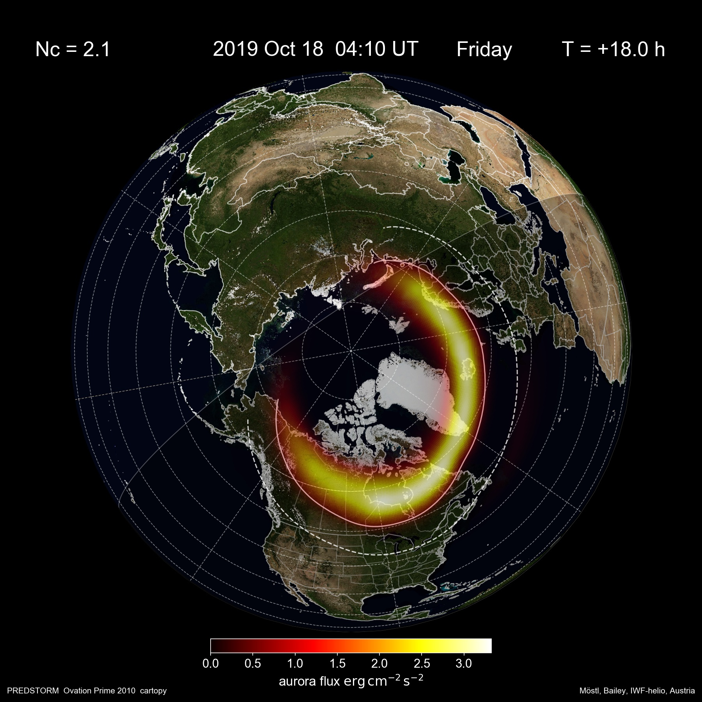
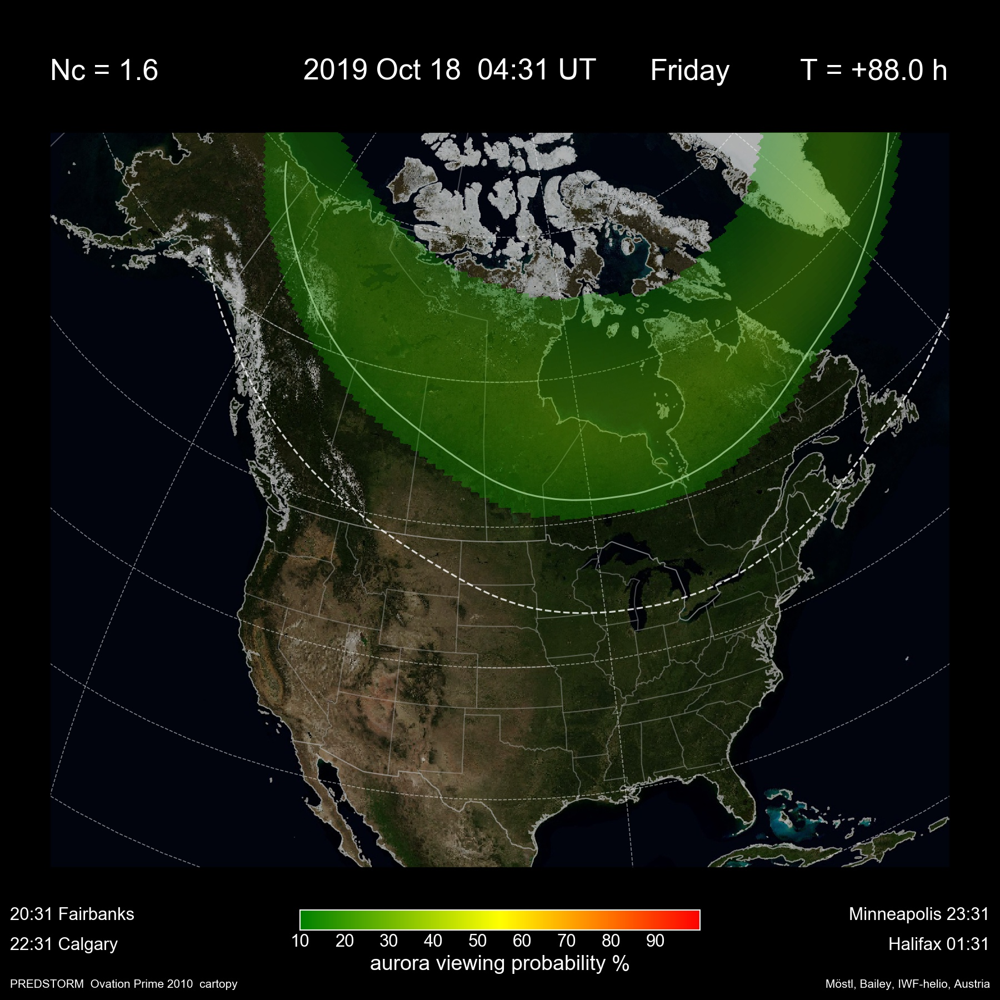
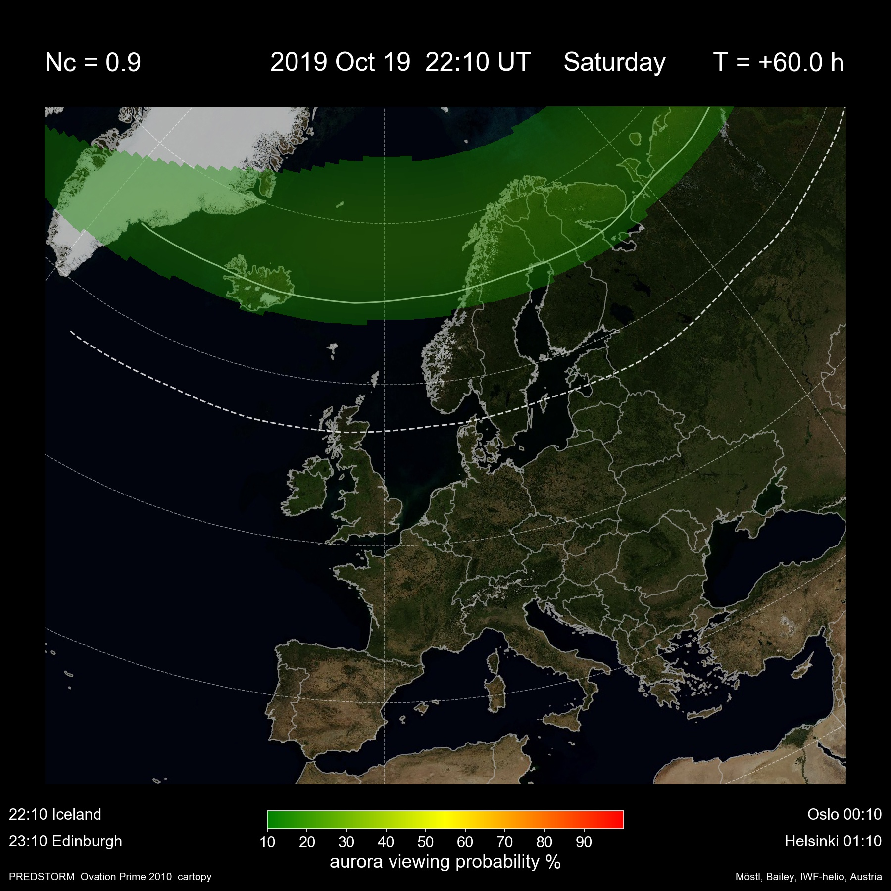

# auroramaps

This is an open-source version of the OVATION Prime 2010 (OP10) aurora model in python. 

Current status (August 2024): This code is redone for usage at the Austrian Space Weather Office. It likely has some bugs, so use with caution. Upgrade to OP13 is foreseen at some point in the future.

https://helioforecast.space

by C. Möstl, Rachel L. Bailey, Austrian Space Weather Office, GeoSphere Austria, Graz, Austria. 
Contributions by  Diana E. Morosan and Liam Kilcommons.

If you want to use parts of this code for generating results for peer-reviewed scientific publications, please contact me per email (chris.moestl@outlook.com) or via https://twitter.com/chrisoutofspace .

The solar wind input comes either from OMNI2 historic data or from the [PREDSTORM](https://github.com/helioforecast/predstorm) L1 solar wind forecast, which is based on data from the DSCOVR or ACE and STEREO-A spacecraft. The results are plotted with [cartopy](https://scitools.org.uk/cartopy/docs/latest/) on different types of world maps. 

OVATION has been largely rewritten based on [Ovation Pyme](https://github.com/lkilcommons/OvationPyme) and open source versions thankfully made available by NOAA and the UK MetOffice.

## Run locally with Docker

```
docker buildx build --platform linux/amd64 -t "aurora:latest" .
docker run --name forecast aurora
```

## Run automatically in AWS

```
# 1. Build image
# 2. Publish image to Docker Hub
# 3. Deploy resources
sam build
sam deploy --capabilities CAPABILITY_NAMED_IAM
```

## Local Installation

Install python with miniconda:

on Linux:

    wget https://repo.anaconda.com/miniconda/Miniconda3-latest-Linux-x86_64.sh
    bash Miniconda3-latest-Linux-x86_64.sh
  
on MacOS:

    curl -O https://repo.anaconda.com/miniconda/Miniconda3-latest-MacOSX-x86_64.sh
    bash Miniconda3-latest-MacOSX-x86_64.sh

In order to load the aacgmv2 package, the gcc compiler needs to be installed. For the animation, it is assumed that ffmpeg (https://ffmpeg.org/download.html) is available system-wide.

    apt update -y
    apt install -y build-essential ffmpeg

Create a conda environment using the "envs/env_aurora1.yml", and activate the environment:

    conda env create -f envs/env_aurora1.yml
    
    conda activate aurora1    

After the installation of the environment, go to a directory of your choice:

    git clone https://github.com/helioforecast/auroramaps


## Usage

Activate the conda environment, and run 

    python aurora.py

or open the .ipynb file in a notebook - the input variables are controlled in *config_local.py* or *config_server.py*. For web deployment, the file *aurora_web.py* is used, which is controlled by the input variables found in *config_web.py*.
   
This produces a folder in the results directory named as given in the config files that contains aurora movies (gif, mp4) and frames for the event, and a plot on the Newell coupling. For the animation, it is assumed that ffmpeg (https://ffmpeg.org/download.html) is available system-wide.


## Documentation (to be updated)


3 modes are available, selected in input.py

 - 0: uses the real time PREDSTORM solar wind prediction.  
 - 1: uses a local file of the PREDSTORM solar wind output.  
 - 2: for using any interval in the OMNI2 data since 1963.

In mode 2, the OMNI2 data are downloaded automatically from https://spdf.gsfc.nasa.gov/pub/data/omni/low_res_omni/omni2_all_years.dat on the first time, and then converted to a pickle for faster processing in new runs. If you want to update the OMNI2 data, just delete both files in "auroramaps/data/omni2/" to force a new download and conversion.

There are 3 types of maps available - a global image of the northern hemisphere and high-resolution maps of Europe and North-America. 
For both maps, flux and probability images can be made, andt here are 3 different background images available (blue marble, VIIRS night band and a topography image). Control all this with files named *config_local.py* (defined for using a Macbook) or *config_server.py* (for Linux).

These are samples with blue marble background for the flux map (global polar view) and the probability map (North America and Europe):





